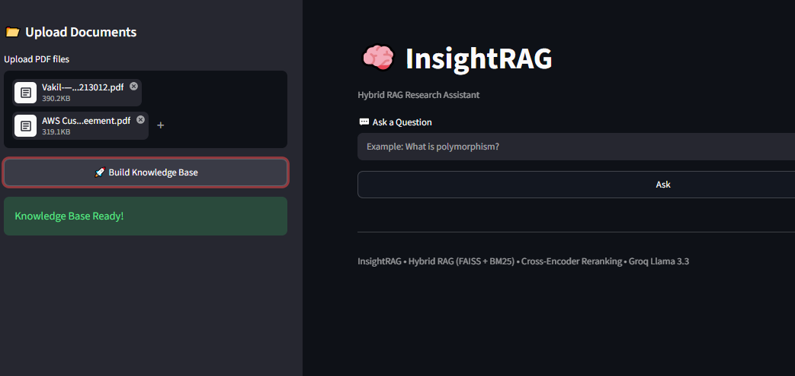
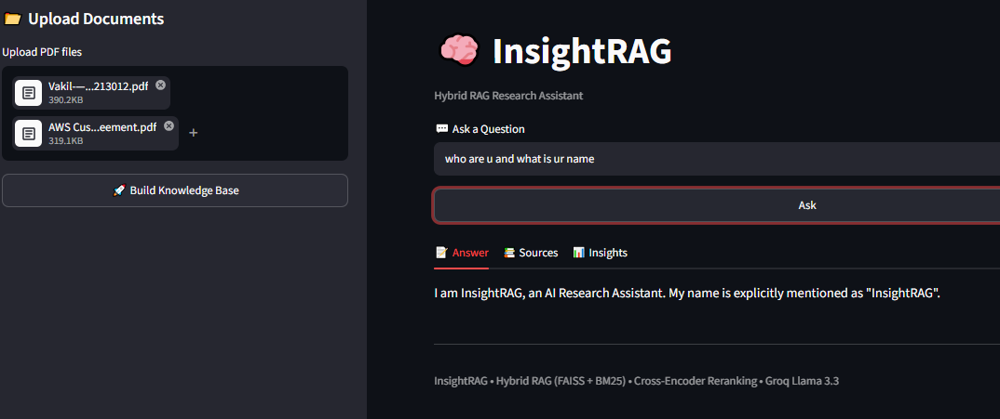
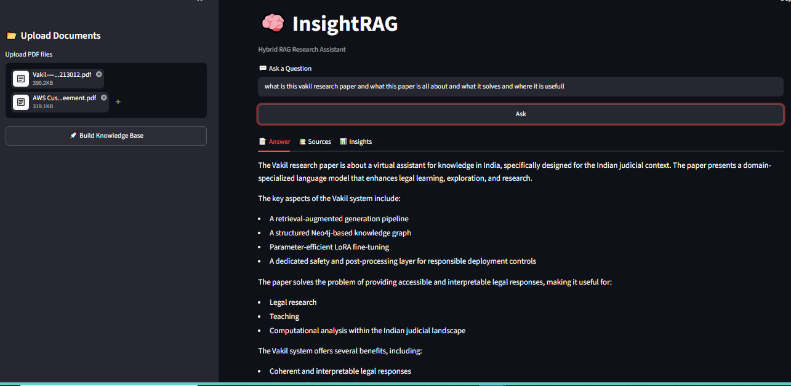
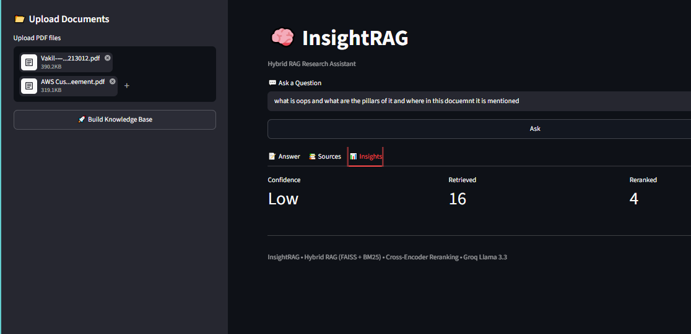

# 🧠 InsightRAG: A Hybrid RAG Research Assistant
 > ## Research Agent (with Citations)
> **An explainable document question-answering system that combines Hybrid Retrieval, Cross-Encoder Reranking, and Large Language Models to generate grounded, citation-backed answers from uploaded PDF documents.**

<p align="center">


</p>

---

# 🎯 Project Objective

The goal of **InsightRAG** is to build an AI-powered document intelligence system capable of answering natural language questions **strictly from uploaded PDF documents** while minimizing hallucinations and providing transparent, explainable responses.

Instead of relying solely on the language model's pretrained knowledge, the system first retrieves the most relevant document passages using a **Hybrid Retrieval pipeline**, reranks them for relevance, and finally generates an answer grounded in the retrieved evidence.

The primary design objective is to prioritize **accuracy, explainability, and modularity** over unrestricted text generation.

---

# 📖 Project Overview

Large Language Models are powerful at reasoning and language generation but cannot reliably answer questions about private or domain-specific documents that were never part of their training data.

Retrieval-Augmented Generation (RAG) addresses this limitation by retrieving relevant document passages before generating a response. However, relying on a single retrieval strategy often leads to incomplete or less relevant results.

InsightRAG adopts a **Hybrid Retrieval** approach by combining:

- **Semantic Retrieval (FAISS)** for understanding contextual similarity.
- **Lexical Retrieval (BM25)** for matching exact keywords and technical terms.
- **Cross-Encoder Reranking** to identify the most relevant document chunks before answer generation.

The retrieved evidence is then passed to **Groq's Llama 3.3 70B** model, which generates a grounded answer using only the supplied context.

Every response includes:

- ✅ Grounded Answer
- ✅ Source Citations
- ✅ Confidence Indicator
- ✅ Retrieval Statistics

---

# 🏗️ Design Principles

InsightRAG was designed around the following engineering principles:

### 1. Grounded Generation

All responses are generated strictly from retrieved document context to reduce hallucinations.

### 2. Explainability

Every answer is accompanied by source citations and retrieval statistics, allowing users to verify where the information originated.

### 3. Retrieval Quality

Instead of relying on a single retrieval mechanism, the system combines semantic and lexical search before reranking the results.

### 4. Modularity

Each stage of the pipeline—document ingestion, retrieval, reranking, and generation—is implemented as an independent module, making the system easier to extend and maintain.

### 5. Cost Efficiency

The system leverages open-source embedding and reranking models together with Groq's hosted inference API to deliver high-quality responses without requiring dedicated GPU infrastructure.

---

# ✨ Key Features

### 📄 Multi-PDF Document Upload

- Upload one or more PDF documents.
- Automatic parsing and preprocessing.
- Supports document collections rather than a single file.

---

### ✂️ Intelligent Document Chunking

Documents are divided into overlapping text chunks using recursive text splitting.

Benefits:

- Preserves contextual continuity.
- Improves retrieval quality.
- Optimizes LLM context utilization.

---

### 🔍 Hybrid Retrieval

Instead of relying on only vector similarity, InsightRAG combines:

- FAISS Semantic Search
- BM25 Keyword Search

using LangChain's Ensemble Retriever.

This improves retrieval robustness across both semantic and keyword-focused queries.

---

### 🎯 Cross-Encoder Reranking

Retrieved candidates are reranked using

**cross-encoder/ms-marco-MiniLM-L-6-v2**

Unlike embedding similarity, the Cross-Encoder jointly evaluates the query and each document chunk, producing a more accurate relevance score.

Only the highest-ranked chunks are forwarded to the LLM.

---

### 🤖 Grounded Answer Generation

Answers are generated using

**Groq Llama 3.3 70B**

The prompt is designed to:

- Use only retrieved context.
- Avoid unsupported claims.
- Clearly indicate when sufficient information is unavailable.
- Adapt the response format based on the user's question instead of following a fixed template.

---

### 📚 Source Attribution

Each response includes:

- Document name
- Page number

allowing users to trace every answer back to the original document.

---

### 📊 Retrieval Insights

The application provides transparency by displaying:

- Retrieved Chunks
- Reranked Chunks
- Confidence Level

These metrics help users understand how the retrieval pipeline arrived at the final answer.

---

# 💡 Why This Architecture?

Traditional Vector RAG systems rely exclusively on semantic similarity, which may struggle with:

- Exact terminology
- Clause numbers
- Section references
- Technical keywords

Conversely, lexical retrieval methods such as BM25 perform well on keyword matching but lack semantic understanding.

To balance these strengths and limitations, InsightRAG combines both approaches within a Hybrid Retrieval pipeline.

The workflow is:

1. Retrieve candidate passages using both semantic and lexical search.
2. Merge and deduplicate the retrieved results.
3. Rerank candidates using a Cross-Encoder.
4. Generate the final answer using only the highest-ranked passages.

This design increases the likelihood that the language model receives the most relevant evidence while maintaining an efficient retrieval pipeline.

---

# 🏛️ System Architecture

```text
                           User
                             │
                             ▼
                  Streamlit Web Interface
                             │
                             ▼
                    InsightRAG Pipeline
                             │
         ┌───────────────────┴───────────────────┐
         ▼                                       ▼
   Document Upload                       User Question
         │                                       │
         ▼                                       ▼
      PDF Parsing                      Hybrid Retrieval
         │
         ▼
   Document Chunking
         │
         ▼
 ┌───────────────────────────────────────────────┐
 │             Ensemble Retriever                │
 │                                               │
 │        FAISS            +            BM25      │
 └───────────────────┬───────────────────────────┘
                     ▼
         Candidate Document Chunks
                     ▼
         Cross-Encoder Reranker
                     ▼
          Top Ranked Context Chunks
                     ▼
          Prompt Construction Layer
                     ▼
           Groq Llama 3.3 70B LLM
                     ▼
      ┌─────────────────────────────────┐
      │ Grounded Answer                 │
      │ Source Citations                │
      │ Confidence Score                │
      │ Retrieval Statistics            │
      └─────────────────────────────────┘
```

---

# ⚙️ Technology Stack

| Component | Technology | Why It Was Chosen |
|------------|------------|-------------------|
| Programming Language | Python 3.11 | Rich AI ecosystem and rapid development |
| Frontend | Streamlit | Lightweight interface for rapid prototyping |
| LLM | Groq Llama 3.3 70B | High-quality instruction-following with low-latency inference |
| AI Framework | LangChain | Simplifies retrieval, prompting, and pipeline orchestration |
| PDF Parsing | PyMuPDF | Efficient extraction of text and metadata from PDF files |
| Embedding Model | BAAI/bge-small-en-v1.5 | Strong semantic retrieval performance with lightweight inference |
| Vector Store | FAISS | Fast and scalable vector similarity search |
| Keyword Retriever | BM25 | Effective lexical matching for exact terms and clauses |
| Reranker | Cross-Encoder MiniLM | Improves ranking precision before generation |
| Environment Management | python-dotenv | Secure configuration using environment variables |


# ⚖️ Engineering Decisions & Trade-offs

Designing a Retrieval-Augmented Generation (RAG) system involves balancing retrieval quality, response accuracy, latency, and implementation complexity. The following decisions were made while developing InsightRAG.

| Design Decision | Benefit | Trade-off |
|-----------------|---------|----------|
| Hybrid Retrieval (FAISS + BM25) | Combines semantic understanding with exact keyword matching, improving retrieval robustness. | Slightly higher retrieval latency compared to using a single retriever. |
| Cross-Encoder Reranking | Produces more relevant context for the LLM by accurately ranking retrieved passages. | Adds an additional inference step before answer generation. |
| Local FAISS Vector Store | Fast similarity search without requiring external vector databases. | Index is rebuilt when new documents are uploaded. |
| Groq Hosted LLM | Low-latency inference without managing GPU infrastructure. | Requires internet connectivity and API access. |
| Modular Pipeline | Independent components simplify testing, debugging, and future enhancements. | Slightly more files compared to a monolithic implementation. |

These trade-offs were chosen to prioritize answer quality, explainability, and maintainability while keeping the system lightweight enough for a take-home project.

---

# 🧠 Prompt Engineering Strategy

The language model is guided using a structured prompt designed to encourage grounded generation.

The prompt enforces the following principles:

- Answer **only** from the retrieved document context.
- Avoid using external knowledge.
- Clearly indicate when sufficient information is unavailable.
- Adapt the response format based on the user's question instead of following a rigid template.
- Combine information from multiple retrieved passages when appropriate.
- Preserve important names, dates, numbers, and technical terminology.

This approach helps minimize hallucinations while allowing responses to remain natural and informative.

---

# 🚀 Installation

## Clone the repository

```bash
git clone https://github.com/Code10x-letscodewithManju/InsightRAG-Hybrid-Research-Assistant.git
cd InsightRAG
```

---

## Create Virtual Environment

Windows

```bash
python -m venv .venv

.venv\Scripts\activate
```

Linux / macOS

```bash
python3 -m venv .venv

source .venv/bin/activate
```

---

## Install Dependencies

```bash
pip install -r requirements.txt
```

---

## Configure Environment Variables

Create a `.env` file in the project root.

```
GROQ_API_KEY=your_groq_api_key
```

---

## Launch the Application

```bash
streamlit run app.py
```

---

# Usage

1. Launch the Streamlit application.
2. Upload one or more PDF documents.
3. Click **Build Knowledge Base**.
4. Wait for the indexing process to complete.
5. Enter a natural language question.
6. Review:
   - Generated Answer
   - Source Citations
   - Confidence Level
   - Retrieval Insights

---

# 💬 Example Questions

### Technical Documents

- What is polymorphism?
- Explain inheritance with examples.
- What is process scheduling?
- Explain deadlocks.

---

### Contracts

- Who are the parties involved?
- What are the payment terms?
- Under what conditions can the agreement be terminated?
- Summarize the confidentiality clause.

---

### Research Papers

- What problem does this paper solve?
- Summarize the proposed methodology.
- What are the main experimental results?
- What limitations are mentioned?

---

# 📸 Screenshots

## Home Page


<p align="center">
  
</p>

<p align="center">
<i>InsightRAG Home Interface</i>
</p>


---

## Answer Generation

<p align="center">
  
</p>

<p align="center">
<i>Example of a grounded response generated from uploaded documents.</i>
</p>


---

## Source Citations

<p align="center">
  
</p>

<p align="center">
<i>Answer with supporting source citations.</i>
</p>


---

## Retrieval Insights

<p align="center">
  
</p>

<p align="center">
<i>Confidence score and retrieval statistics displayed to the user.</i>
</p>


---

# ⚠️ Current Limitations

Although the system performs well for document question answering, several limitations remain.

- FAISS index is rebuilt whenever new documents are uploaded.
- OCR is not implemented for scanned PDFs.
- Confidence score is heuristic rather than model-calibrated.

---

# 🔮 Future Improvements

Several enhancements can further improve the system.

- Persistent FAISS index
- OCR support for scanned documents
- Metadata-aware retrieval
- Conversational memory
- Streaming response generation
- Multi-modal document understanding
- Automated evaluation framework
- Agentic workflows for multi-step document analysis

---

# 📚 Project Highlights

- Hybrid Retrieval using FAISS and BM25
- Cross-Encoder reranking for improved relevance
- Grounded answer generation using Groq Llama 3.3 70B
- Automatic source citations
- Confidence estimation
- Modular architecture
- Interactive Streamlit interface
- Explainable document question answering

---
